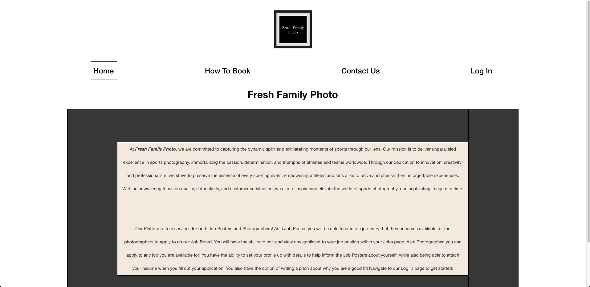
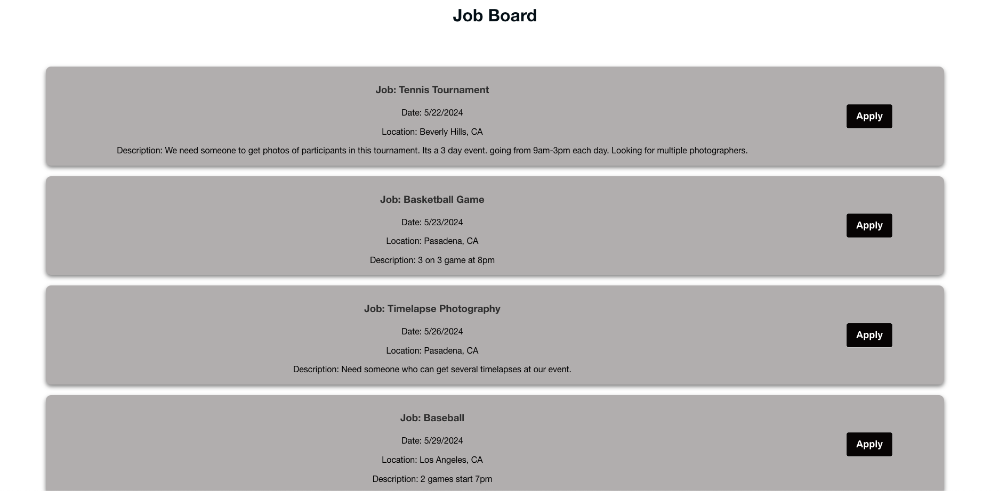
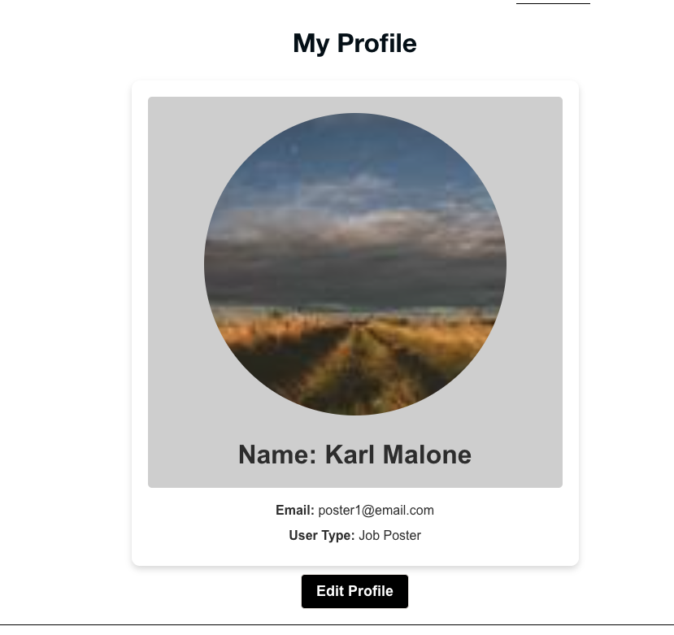
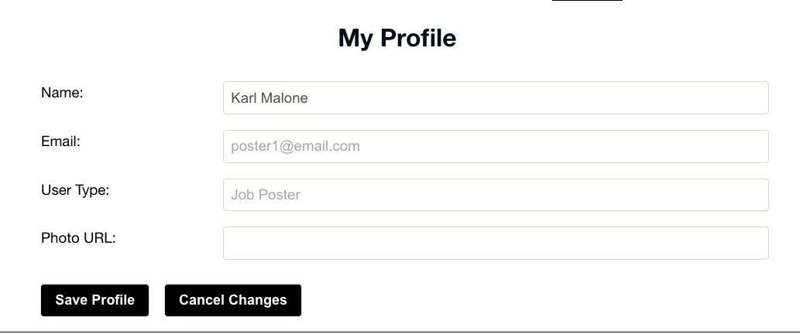
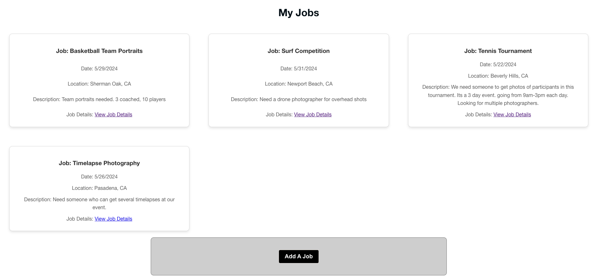

# Fresh Family Photo

## Intro

At Fresh Family Photo, we are committed to capturing the dynamic spirit and exhilarating moments of sports through our lens. Our mission is to deliver unparalleled excellence in sports photography, immortalizing the passion, determination, and triumphs of athletes and teams worldwide. Through our dedication to innovation, creativity, and professionalism, we strive to preserve the essence of every sporting event, empowering athletes and fans alike to relive and cherish their unforgettable experiences. With an unwavering focus on quality, authenticity, and customer satisfaction, we aim to inspire and elevate the world of sports photography, one captivating image at a time.

Our Platform offers services for both Job Posters and Photographers! As a Job Poster, you will be able to create a job entry that then becomes available for the photographers to apply to on our Job Board. You will have the ability to edit and view any applicant to your job posting within your Jobs page. As a Photographer, you can apply to any job you are available for! You have the ability to set your profile up with details to help inform the Job Posters about yourself, while also being able to attach your resume when you fill out your application. You also have the option of writing a pitch about why you are a good fit!

## Screenshots

## Tech used

## Getting Started

[Click here](https://fresh-family-photo-ff142513c532.herokuapp.com/) to checkout my application!

[Click here](https://trello.com/b/kObLwAVb/photography-platform) to view my Trello Board which shows the planning process

## Next Steps

- State of the Job, whether it is active
- Implement Notes to aid Job posters in keeping track of the different applicants
- Implement A Review system for photographers
- Pricing and Payment
- Photographers Upload catalog of photos from the job the completed
- System for tracking visitors who have submitted contact forms
